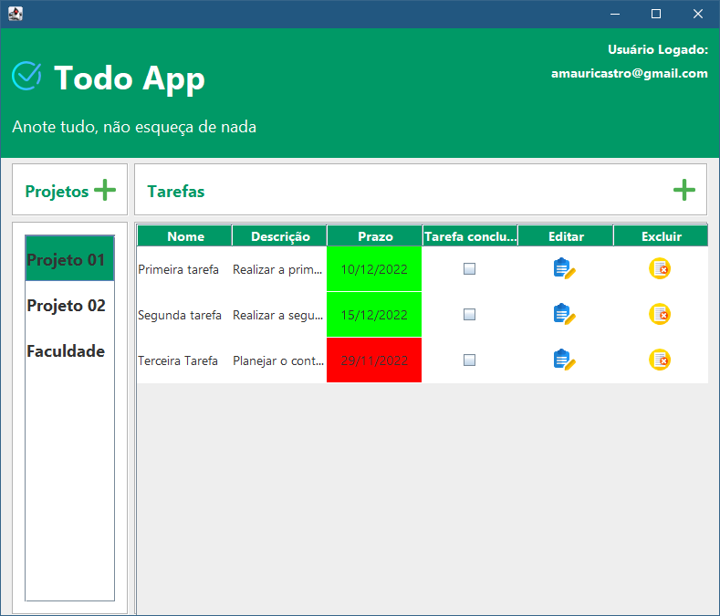

# TodoApp

 Descrição: Aplicação para o gerenciamento de projetos e as tarefas envolvidas nesses projetos.
Objetivo: Resolver a questão de organização de tarefas de um ou vários projetos.

Desenvolvido durante o curso Lógica de Programação III do programa Start da Capgemini

**Tecnologias utilizadas:**
 - Java
 - Swing
 - MySQL

